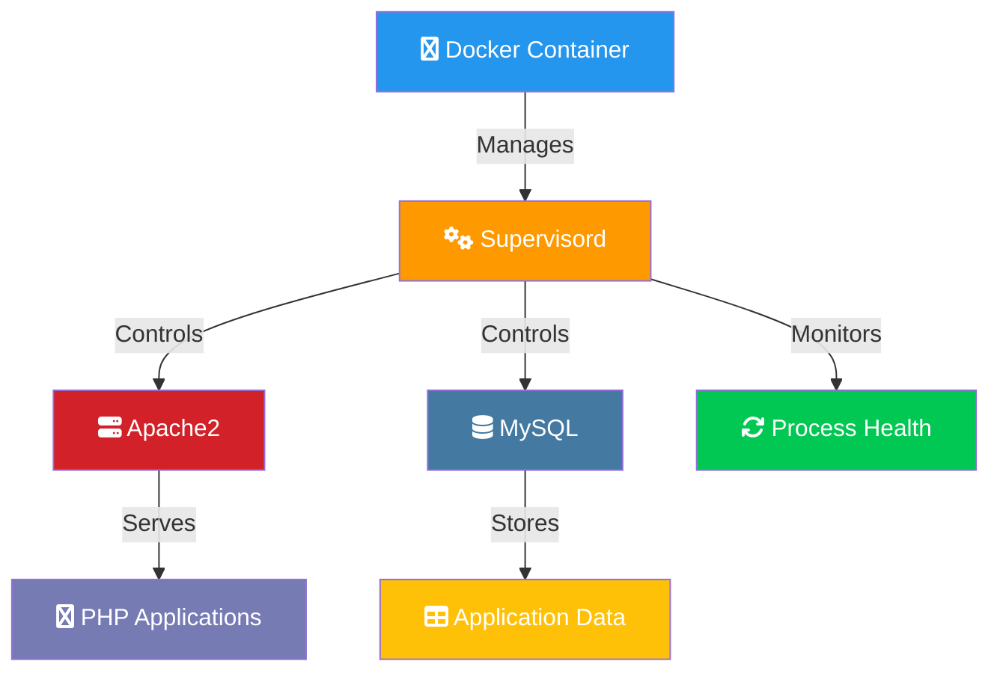

# 🚀 Docker Process Management with Supervisor

[](https://github.com/TheToriqul/docker-supervisor)
[](https://github.com/TheToriqul/docker-supervisor/stargazers)


## 📋 Overview

This project demonstrates advanced Docker container management using Supervisor to maintain multiple processes within a single container. Through building a LAMP stack container with Supervisor, I've explored essential concepts in container orchestration and process management. This implementation showcases how to effectively manage mission-critical services while ensuring high availability and reliability.

## 🏗 Technical Architecture

The project implements a multi-process container architecture using Supervisor as the process manager. Here's how the components work together:



## 💻 Technical Stack

- **Container Runtime**: Docker
- **Base Image**: Ubuntu Latest
- **Web Server**: Apache2 with PHP
- **Database**: MySQL
- **Process Manager**: Supervisord
- **Programming Language**: PHP 7.4+

## ⭐ Key Features

1. Process Management
   - Automated process monitoring
   - Automatic process recovery
   - Parallel process execution
   - Custom restart policies

2. LAMP Stack Integration
   - Apache2 web server configuration
   - MySQL database setup
   - PHP module integration
   - Dynamic process control

3. Monitoring & Logging
   - Real-time process status
   - Centralized logging
   - Event tracking
   - Health checks

4. Container Management
   - Port mapping
   - Volume management
   - Resource allocation
   - Environment configuration

## 📚 Learning Journey

### Technical Mastery:

1. Advanced Docker container orchestration
2. Process management in containerized environments
3. High-availability service configuration
4. Multi-process container architecture
5. System monitoring and logging
6. Service recovery automation

### Professional Development:

1. Infrastructure design patterns
2. System reliability engineering
3. Documentation best practices
4. Problem-solving methodologies
5. Performance optimization techniques

## 🔄 Future Enhancements

<details>
<summary>View Planned Improvements</summary>

1. Implement custom health check mechanisms
2. Add Redis for session management
3. Integrate Prometheus monitoring
4. Implement automatic backup solutions
5. Add horizontal scaling capabilities
6. Create Docker Compose configuration
</details>

## ⚙️ Installation

<details>
<summary>View Installation Details</summary>

### Prerequisites

- Docker Engine 20.10+
- Git
- 2GB RAM minimum
- 10GB disk space

### Setup Steps

1. Clone the repository:
```bash
git clone https://github.com/TheToriqul/docker-supervisor.git
cd docker-supervisor
```

2. Build the Docker image:
```bash
docker build -t lamp-supervisor .
```

3. Run the container:
```bash
docker run -d -p 80:80 -p 3306:3306 --name lamp-container lamp-supervisor
```

### Configuration

```env
MYSQL_ROOT_PASSWORD=your_secure_password
APACHE_PORT=80
MYSQL_PORT=3306
```

</details>

## 📫 Contact

- 📧 Email: toriqul.int@gmail.com
- 📱 Phone: +65 8936 7705, +8801765 939006

## 🔗 Project Links

- [GitHub Repository](https://github.com/TheToriqul/docker-supervisor)
- [Documentation](https://github.com/TheToriqul/docker-supervisor/blob/main/README.md)

## 👏 Acknowledgments

- [Poridhi for excellent labs](https://poridhi.io/)
- Docker Documentation
- Supervisor Documentation
- LAMP Stack Community

Feel free to explore, modify, and build upon this configuration as part of my learning journey. You're also welcome to learn from it, and I wish you the best of luck!